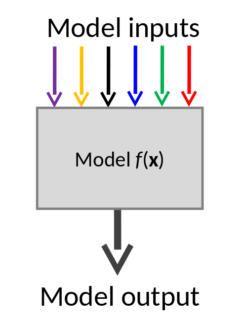
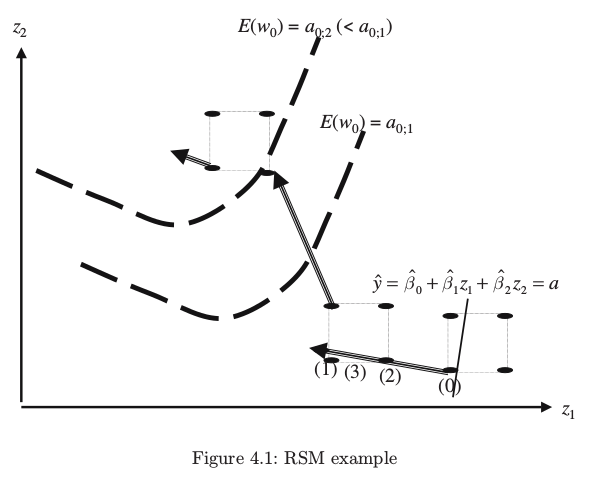
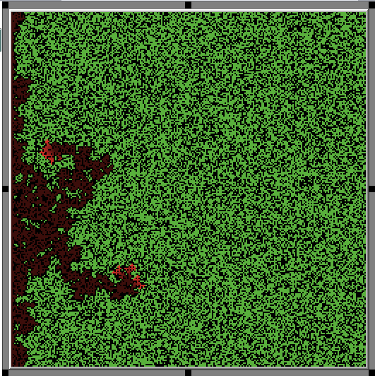

class: inverse
## Motivation

---
# Why computational experiments?

```{r setup, include=FALSE}
options(htmltools.dir.version = FALSE)
library(tibble)
library(dplyr)
library(ggplot2)
library(magrittr)
library(DT)
```

The construction of simulation is typically painstaking and time-consuming.


> *Once I've built my simulation, I will just run it and use the results to answer my question*

--

## But

The flexibility ABMs allow in model specification typically means that they have many parameters.

Some of these may be difficult to fix using empirical data, or even entirely abstract.

1. __How do these parameters affect simulation behaviour?__
2. __What are the 'correct' parameter values?__

We can conduct and analyse experiments to answer these questions


---
# Sources of Uncertainty

## Uncertainty about the simulation output
1. __Simulation stochasticity__ Uncertainty associated with random number generation in simulation code.
2. __Response uncertainty__ Uncertainty about how the simulation will respond to changes in inputs.

--

## Uncertainty about reality
2. __Input uncertainty__ Lack of knowledge about the true value of simulation inputs
4. __Model discrepancy__ Uncertainty about how well your model reflects reality.
5. __Measurement error__ How accurate are our measurements of reality?


*(Kennedy and O'Hagan 2001)
---
# Preview
The rest of this talk will cover a range of areas:

## Part 1
- Introduction to design of experiments and meta-models
- Factorial designs and regression meta-models
- Simulation stochasticity and Monte Carlo Methods

## Part 2
- Kriging metamodels and Latin Hypercube Samples
- Advanced topics
  + Screening and automatic relevance detectiosn
  + Uncertainty and Sensitivity Analysis
  + Calibration
- Practical considerations in conducting experiments

---
# About these lectures

Aim: Whistlestop tour of the tools available for analysing simulation experiments
- You may not grasp everything straight away.
- You will know where to look when you get to this stage in your own projects.
- R code relating to examples is available with the slide codes

---
class: inverse

## Introduction to Meta-Models and Design of Experiments

---
# What is an experiment? 

## Experiment
> Process of measuring a “stochastic response corresponding to a set of … input variables” 

## Computer experiment
>Experiment based on a [...] theory, implemented by using numerical methods with appropriate computer hardware and software

.Small[
TJ Santner, BJ Williams, WI Notz, 2003, The Design and Analysis of Computer Experiments. New York: Springer, p 2
]


---
# Exploring a simulation

Consider a simulation with two input parameters. What values of these inputs should we run the simulation at to learn more about it?

We might hold one parameter fixed and vary the others with regular intervals.

We can plot this on the **parameter space**:
.center[
```{r, echo=F, fig.height=4}

des1_df <- as_tibble(expand.grid(`Input 1` =seq(0,1,length.out=5),
                      `Input 2`=0.5))
ggplot(des1_df,
       aes(x=`Input 1`,y=`Input 2`)) +
  geom_point(colour="blue", size=4)+
  theme_minimal(base_size = 14)+
  ylim(0,1) +
  coord_fixed()

```
]


---
# Exploring a simulation

We can do this for both inputs.
This is known as a "One at A Time" (OAT) design.

.center[
```{r, echo=F}

des2_df <- rbind(des1_df,
                 as_tibble(expand.grid(`Input 1`=0.5,
                                       `Input 2`=seq(0,1,length.out=5))))
ggplot(des2_df,
       aes(x=`Input 1`,y=`Input 2`)) +
  geom_point(colour="blue", size=4)+
  theme_minimal(base_size = 14)+
  ylim(0,1) +
  coord_fixed()

```
]
---
# Exploring a simulation

One option is take all combination of levels. 
This is known as a factorial design.

.center[

```{r, echo=F}

des2_df <- as_tibble(expand.grid(`Input 1`=seq(0,1,length.out=5),
                      `Input 2`=seq(0,1,length.out=5)))
ggplot(des2_df,
       aes(x=`Input 1`,y=`Input 2`)) +
  geom_point(colour="blue", size=4)+
  theme_minimal(14)+
  ylim(0,1) +
  coord_fixed()

```

]
---
# Curse of Dimensionality

The more inputs you have, the more difficult it is to analyse your model!

Consider a simulation where you want to examine outputs for three levels for each input. 

--

For one input, 3 observations are required. For two inputs, 9...


--
.center[
```{r, echo=F, fig.height=4, fig.width=13}
levels=3

dimens_df <- as_tibble(expand.grid(dimensions=1:12,levels=3:5)) %>%
  mutate(points=levels**dimensions,
         levels=as.factor(paste(levels, " levels"))) 

ggplot(dimens_df, aes(x=dimensions,y=points,colour=levels)) + geom_line()+ 
  theme_bw(base_size = 15) +
  scale_y_continuous(labels=scales::scientific_format()) +
  #scale_y_log10(labels=scales::scientific_format()) +
  scale_x_continuous(breaks=seq(0,12,3))+
  facet_wrap(~levels, scales="free") +
  ggtitle("Number of points needed to maintain a fixed spacing")
  

```
]
---
# The challenges of analysing simulations

Some common questions:

- With so many inputs, how can I understand what each does?

--
- I have a limited computational budget. Where should I run my simulation

--

- I have a load of outputs at different input combinations. How can I understand them.


---
# Simulations as a black box

.pull-left[
The first steps in analysing our simulation becomes easier if we ignore the details and think of the simulation as a function or map.

A function takes some input values inputs, does something to them, and spits out an output. 
]

.pull-right[

]

---
# Simulations as a black box
.Large[
We can write this in mathematical terms
$$y=f(\pmb{x}) + \epsilon$$ 

Where $\pmb{x}$ is the vector of simulation inputs, $y$ is the simulation output, and $\epsilon$ is a random error reflecting simulation variability.
]


--

1. What values should I choose for $x$?
2. What form should the function $f$ take?


--
__In fact these questions are related!__

---
# Terminology 

- Parameters vs Inputs
  + The meaning of these words can differ from discipline for discipline, and may also differ depending on the particular question you are considering. 

  + We consider both to mean a value which can be varied in your simulation, and which may change the simulation behaviour.

--
- Output vs Response
  + Simulation outputs are often refered to as the response of the simulator to particular inputs values.

--
- Factors and levels
  + It is common to refer to the inputs we are studying as 'factors', and to examine the response at a small number of fixed values of these factors, termed the levels.

---
# Terminology

- Design
  + The set of points at which you measure (run your simulator) for a particular experiment


--

- Meta-Model or emulator
 + A statistical model applyed to the simulation model - a model of a model, it 'emulates' (mimics) the behaviour of the simulation

---
# Conventions and assumptions

## Standardised inputs
As with other fields (e.g. machine learning) it is common to rescale inputs to lie in a standardised interval, e.g. [0,1] or [-1,1]. 

This allows better comparison across input dimensions. A one unit change in one variable means the same as a one unit change in another.

--

## Standardised outputs

Often it can also be helpful to rescale outputs as well.

$$
z = \frac{y- \bar{y}}{\sigma(y)}
$$

Particularly if output values are large - this avoids potential numerical problems such as overflow during analysis.

---
## Meta-Models

We can fit statistical models to simulation results just as we would to survey data or experimental data.

--
## Exercise

- What are the major differences between a statistical model fitted on observational data and on experimental data?

- What about between physical and computational experiments?

---
# Regression Metamodels
A regression meta-model can be fitted to input-output combinations obtained from a simulation, as with observational data (Kleijnen 2008).

- Standard fitting techniques (Ordinary Least Squares)

- Simple parameter interpretations and local sensitivity measures

- Statistical testing of parameter coefficients

- Facilitates optimisation/calibration with Response Surface Methodology (Montgomery 2013, e.g. Grow and Van Bavel 2015)


---
# Model Assumptions

When we fit a statistical model, we make assumptions about the relationships between inputs and outputs.

- A constant only model assumes changes in inputs do not affect outputs.
- A simple linear model $y=\beta_0 + \beta_1 x_1 + \beta_2x_2 + \epsilon$ assumes the effect of $x_1$ on $y$ does not change for different values of $x_2$
- Assumption about the error distribution (e.g. normality, constant variance)
---
# Assumptions and Design

The assumed model in turn affects the appropriate design.
- If the constant model is true and input values do not affect output, then we only need one design point
- To estimate the variance of the error term, we need repeated observations at least one point.
- If the mode with only linear terms is true, we need at least two observations for each dimension
- If there are quadratic effects, we need three observations
- If there are interactions, more design points are needed...

--
- In general, we need at least as many design points as there are structural parameters to estimate.

---
# Model identification
Assuming $p$ is the number of inputs.

| Model     | Form  |  Number of structural terms  |
|-----------|---|---|
| Constant                | $y=\beta_0 +\epsilon$  | $1$  |
| Linear                  | $y=\beta_0 + \sum_i\beta_ix_i +\epsilon$  |   $p + 1$ |
| Linear w/ Interactions  | $y=\beta_0 + \sum_i\beta_ix_i + \sum_i\sum_{j \neq{i}}\gamma_{ij} x_ix_j +\epsilon$  |  $1 + p  + \left(\begin{array};p \\ 2\end{array}\right)$ |
| Quadratic  | $y=\beta_0 + \sum_i\beta_ix_i + \sum_i\gamma_i x^2_i +\epsilon$  | $1 + 2p$  |
| Quadratic w/ Interactions  | $y=\beta_0 + \sum_i\beta_ix_i + \sum_i\sum_j\gamma_{ij} x_ix_j +\epsilon$   | $1 + 2p +  \left(\begin{array};p \\ 2\end{array}\right)$ |

---
# Factoral designs

A full factorial design involves a combination of all factors by all levels.
.center[
```{r,echo=F, message=F, warning=F}
library(AlgDesign)
ff33 <- AlgDesign::gen.factorial(3,3)

library(plotly)
with(data=ff33, plot_ly( x=X1, y=X2, z=X3, type="scatter3d",
                        mode="markers", color=X3))
```
]

---
# Central Composite Design
Constructed from a 2-level factorial design with added (repeated) central and axial points.

.center[
```{r,echo=F, message=F, warning=F}
library(rsm)
ccd_1 <- ccd(3)

with(data=ccd_1, plot_ly( x=x1, y=x2, z=x3, type="scatter3d",
                        mode="markers",color=x3))

```
]

--- 
# Blocking

You may see this discussed in the experimental literature
- Some experimental designs (e.g. CCD) can be divided into blocks of design points
- Each block allows the independent estimation of a subset of the effects of interest, without needing the other runs.
- This is relevant in physical experiments where the conditions of the experiment are imperfectly controlled. 
- E.g. Perhaps the manufacturing conditions are different one day to the next.

--
- **This is not really relevant in computer experiments (Kleijnen 2008)**

---
# Regression Meta Model example
- We can run the schelling model at a points defined by a central composite design, and fit a second-order polynomial regression metamodel.

- The meta-model tells us that the parameter controling agent preferences with respect to neighbours has a quadratic effect. 

.center[
```{r, echo=F, fig.height=5}
library(rsm)
res_ccd <-readRDS("example_data/schelling_ccd.rds")

res_ccd %<>% select(x1,x2, Response) %>%
  rename(pc_desired=x1,
         density=x2,
         pc_similar=Response)

rsm_mod <- rsm(pc_similar ~ SO(pc_desired,density), data=res_ccd)

contour(rsm_mod,~ pc_desired + density,xlabs = c("density","pc_desired"))
points(res_ccd$pc_desired,res_ccd$density, col="red",pch=19)

```
]
---
# Validation

However, we need to ensure this meta-model is a valid stand-in for the simulation.

We can decompose the total error in the metamodel approximation into that associated with random variation from the simulation average and that caused by poor metamodel approximation (Kleijnen 2008). 

```{r}
loftest(rsm_mod)

```

---
# Improving metamodels

In this case, the regression meta-model does not appear to capture  the behaviour of the simulation well.

There are a number of strategies for countering lack of fit.
- Increase the order of the polynormial terms in the meta-model
- Restrict parameter ranges to a smaller area of the space, where behaviour may by more regular
- Fit a model with fewer assumptions (see Part 2)

---
# Heteroskedasticity

Regression meta-models typically assume simulation error that is constant over the parameter

- Violation of this assumption will not bias effect estimates
- It will bias standard errors, and thus inference about effects


--
Sometimes transformation will remove the problem of heteroskedasticity

Running the simulation multiple times at each point, and incorporating information about the variance in the estimation through Weighted Least Squares will provide a way round this problem (Kleijnen 2008).

---
# Cross-Validation of meta models

In order to understand if our meta-model accurately captures the behaviour of the simulation, we can attempt cross validation as well

- Generate random points in the parameter space
- Run the simulation repeatedly at these points
- Compare the simulation outputs to meta-model predictions at these points

We can calculate the summaries of error such as Root Mean Squared error or Mean Absolute Percentage errors, and see if these fall within acceptable tolerances.

---
# RSM and Optimisation

In some cases we may wish to **calibrate** our simulation so that its outputs match empirical observations.

We can treat this as an optimisation problem and attempt to minimize the error between our simulation and the observations (c.f. Grow and Van Bavel 2016):

$$
\text{min}_x \; E[(f(x)- z)^2]
$$
where $z$ is our observation of the true process.


---
# Response surface methodology

RSM is an iterative process (Kleijnen 2008, Montgomery 2013):
- A starting point is chosen based on our best guess as to where the best point might be.
- A regresion meta-model is fitted to a 2-level factorial design evaluted in the area around the starting point (a *local* meta-model)


--
- This is is used to determine the most promising direction to move to reach the minimum.
- These steps are repeated until no improvment possible
- In the region of the optimum, a CCD and 2-order polynomial metamodel is fitted
- Set the derivative of this meta-model to zero to find the stationary point, and using eigen-analysis to determing its nature


---
# RSM



(Kleijnen 2008, p 107)

---
class: inverse

## Simulation Stochasticity

---
# Pseudo-Random Numbers

Computer Random number generators are not _really_ random.

In fact they are deterministic sequences of numbers with _extremely_ long periods that look random. 

This means you are unlikely to generate the same set of numbers twice, unless you choose to. 

Random number generators are *seeded* by provided them with a single number, which will return the same set of numbers. 

- To reproduce results, run with the same seed.
- To measure simulation stochasticity, we need to conduct many runs with different random seeds.

> If a seed is not specified, Netlogo will choose one based on the current date and time.

---
# Monte Carlo Experiments

Monte Carlo methods are so named because of the way they employ randomness, like the casinos in Monte Carlo, Monaco.

We want to know the distribution of a function of a random quantity, but we can't 'do the maths' to find it out.


The logic is:
1. Generate from an input distribution
2. Evalutate the function
3. Save the output value

The collection of output values is a sample from the distribution we need, and we can calculate its mean, variance and quantiles.

---
# Monte Carlo as integration

When we use Monte Carlo methods, we are really conducting integration

$$
E[y] = \int f(x)dx \approx \frac{1}{S}\sum_{i=1}^{S}f(x_i)
$$
--
As an example:
$$
f(x) = x^{2} \; ,
x \in [0,1] \\\\
\int_0^1x^2dx= \frac{x^3}{3} \;\Big|_0^{1} = 1/3
$$
--
And by Monte Carlo

```{r}
x <- runif(10000,min=0,max=1)
mean(x**2)

```

---
# Estimating the area of a circle

As an example we can use Monte Carlo methods to estimate the area of a circle

- Draw a circle of radius 1 inside a square with sides of lengths 1
- Simulate x and y values that fall inside the square $x,y \sim U(0,1)$
- Record whether each (x,y) point falls inside the circle.
- The proportion of points inside to those outside the circle is its area.

--

We can estimate \pi from the is proportion too:  the area of the circle is approximately $\pi r^2 =$ `r pi/4`


---
class: tight
# Estimating the area of a circle


```{r}
df <- tibble(x=runif(1000),y=runif(1000)) 
# radius, centre x, centre y
r <- 0.5; a <- 0.5; b <- 0.5 
df %<>% mutate(dist = sqrt((x - a)^2 + 
                         (y - b)^2),
               Inside = (dist < r))
area <- df %>% summarise(area=sum(Inside)/n())
```


.center[
```{r, echo=F, fig.height=4, fig.width=6}

ggplot(df, aes(x=x,y=y,colour=Inside)) +
  geom_point() +
  stat_function(fun=function(x) sqrt(r^2 - (x - a)^2) + b) +
  stat_function(fun=function(x) -sqrt(r^2 - (x - a)^2) + b) +
  coord_fixed() + theme_minimal(base_size = 16) +
  ggtitle(paste0("Area estimate =", area[[1]]))


```
]


---
# Example - Forest Fire in Netlogo
In our case, the function is a simulation!

.pull-left[
The forest fire example model is a very simple 1 parameter model in Netlogo that models the spread of a fire through a forest. 
- The parameter controls the density of the trees in the randomly generated forest
- The fire spreads more easily through densely populated forests.
- We are interested in the number of trees that burn. 
]
.pull-right[


]
---
# Example - Forest Fire in Netlogo

Running the model multiple times at one density value gives us an idea of how much the random arrangement of trees on simulation set-up effects the outcome.

```{r, echo=F, fig.width=12, fig.height=5, warning=F,message=F}
burned_trees_df <- readRDS(file.path("example_data", "burned_trees_100.rds")) %>%
  mutate(N=as.factor(100))

ggplot(burned_trees_df, aes(x=proportion_burned)) + 
  geom_histogram(aes(y=stat(density), fill=N), alpha=0.5) +
  geom_density(aes(colour=N)) + 
  theme_minimal(base_size=18)

```

---
# Example - Forest Fire in Netlogo

Running the model multiple times at one density value gives us an idea of how much the random arrangement of trees on simulation set-up effects the outcome.

```{r, echo=F, fig.width=12, fig.height=5}
burned_trees_2_df <- readRDS(file.path("example_data", 
                                       "burned_trees_1000.rds")) %>%
  mutate(N=as.factor(1000))

burned_trees_df <- rbind(burned_trees_df, burned_trees_2_df)

ggplot(burned_trees_df, aes(x=proportion_burned, group=N, fill=N)) + 
  geom_density(alpha=0.3)+
  theme_minimal(base_size=18) +
  ylim(0,6)

```

Increasing the sample size improves the accuracy of our estimation
---
# Sampling from inputs

At the moment we are only looking at the output distribution that results from simulation stochasticity - the random number generation.

--
## Exercise

Assume that you are interested in what proportion of a particular forest will burn down, should a fire start. 

- You know that the density of this forest has been measured to be approximately 0.65,  with a potential measurement error with a standard deviation of 0.2.

-- 
Design a Monte Carlo experiment using the 'fire' simulation to estimate the mean proportion of trees that will burn. 

- Write in pseudo-code if it helps you think!

--
- What assumptions are you making?

---
# Uncertainty analysis

The process of finding out about the uncertainty in a simulations output, and how it is affected by input uncertainty is known as uncertainty analysis.

- We are propogating error from our inputs into error in our outputs
- This has a range of applications in sensitivity analysis too.

--
- More on this is part 2


