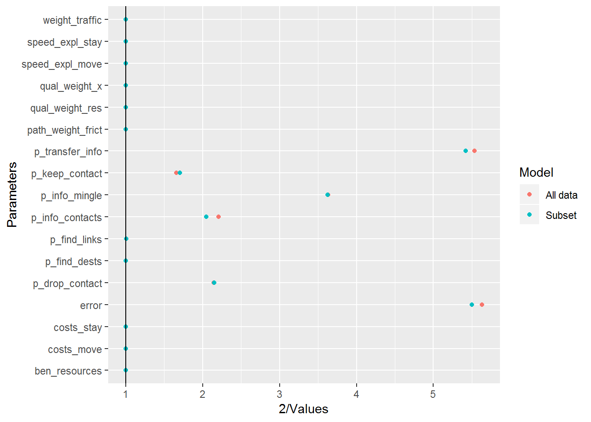
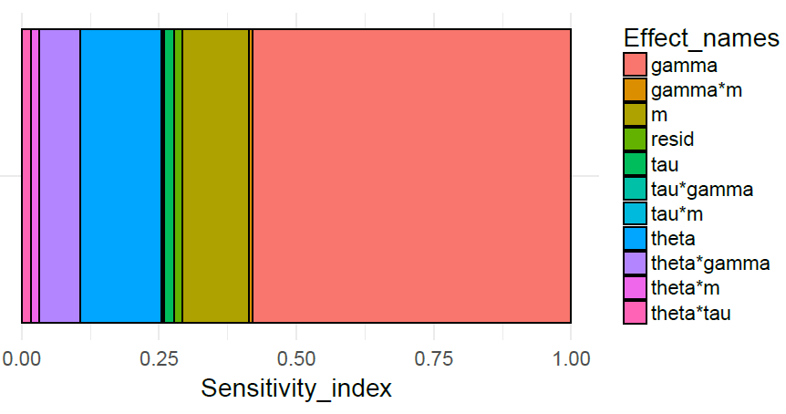
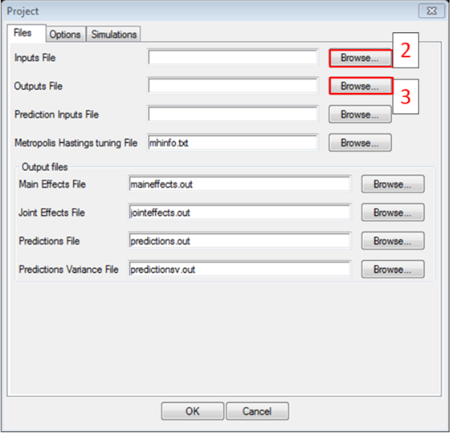
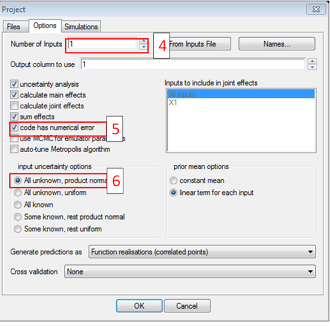
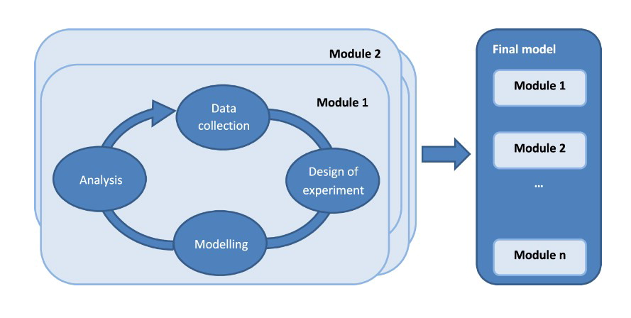

class: inverse
## Motivation


---
# Refresher


## Part 1
- Introduction to design of experiments and meta-models
- Factorial designs and regression meta-models
- Simulation stochasticity and Monte Carlo Methods

## Part 2
- Kriging metamodels and Latin Hypercube Samples
- Advanced topics
  + Screening and automatic relevance detectiosn
  + Uncertainty and Sensitivity Analysis
  + Calibration
- Practical considerations in conducting experiments

---
# Sources of Uncertainty

## Uncertainty about the simulation output
1. __Simulation stochasticity__ Uncertainty associated with random number generation in simulation code.
2. __Response uncertainty__ Uncertainty about how the simulation will respond to changes in inputs.

--

## Uncertainty about reality
2. __Input uncertainty__ Lack of knowledge about the true value of simulation inputs
4. __Model discrepancy__ Uncertainty about how well your model reflects reality.
5. __Measurement error__ How accurate are our measurements of reality?


*(Kennedy and O'Hagan 2001)

---
# Bayesian statistics

Bayesian statistics provides a way of incorporating different sources of uncertainty coherently

- In contrast to frequentist statistics, probability can be understood as a measure of our personal uncertainty about an unknown quantity.
- Our prior belief $p(\theta)$ about this quantity is updated in light of the evidence (likelihood) $p(y| \theta)$ to arrive at a posterior $p(\theta| y)$.

$$p(\theta | y) = \frac{p(y | \theta)p(\theta)}{p(y)}$$

- So our uncertainty about simulation outputs at input combinations we have yet to run, about our prior considerations of model discrepancy and about measurement error can all be treated the same.

---
class: inverse

## Gaussian Processes and Latin Hypercube Samples

---
# Modelling assumptions

- Regression metamodels typically assume that simulations have particular functional forms
- That is,  the function $f()$ is a low order polynomial in the input variables $x$.

--
- What assumptions can we really make about our simulator?

--
- Complexity theory suggests we might expect feedback loops, emergent behaviour and phase transitions.

---
# Example 
Take a funky-looking test function:
$$
y= \beta_0 + \beta_1x_1 + \beta_2x_1x_2 + \beta_4x_1^4 + \beta_5\text{sin}(2x_2\pi)
$$

```{r setup, echo=F,warning=F, message=F}

knitr::opts_chunk$set(echo=F, warning=F, message=F, cache =F )
library(rsm)
library(purrr)
library(dplyr)
```

```{r ,echo=F, message=F,warning=F, error=F, fig.width=10}


X_df <- readRDS("example_data/test_function.rds")
library(ggplot2)
#ggplot(X_df, aes(x=Var1, y=Var2, fill=y)) + geom_tile() + scale_fill_viridis_c()
library(plotly)
library(magrittr)
library(lhs)
library(tibble)

with(data=X_df, plot_ly( x=Var1, y=Var2, z=y, type="mesh3d",
                         colorscale=y,
                         opacity=0.5, intensity=y,
                         colorscale="viridis") %>% layout(
    autorange = F, 
    aspectmode = 'manual', 
    scene = list(
      aspectratio = list(x = 1, y = 1, z = 1)
    )))

```

---
# Regression Meta-models 
Even without simulation stochasicity, low-order polynomials unsurprisingly prove a poor fit to this function.

```{r,echo=F,warning=F, message=F}
ccd_1 <- ccd(2)

set.seed(1434)
test_function <- function(X, B){
  cbind(1, X, X[,1] * X[,2], X[,1]*X[,1]*X[,1]*X[,1], 
        sin(X[,2]*2*pi)) %*% as.matrix(B)
}

# define the true function so that it ignores any additional columns of X
get_true_function <- function(true_beta){
  true_func <- function(X){
    test_function(X[,1:2], true_beta)
  }
  return(true_func)
}

# some arbitrary coefficients
true_beta <- c(3,-0.5,0.25, 2, -1/10,1)
true_function  <- get_true_function(true_beta)

y <- ccd_1 %>% select(x1,x2) %>% as.matrix() %>% true_function()

#y <- df(y) ( 0.1)

ccd_1$Response <- y 
rsm_mod <- rsm(Response~SO(x1,x2), data=ccd_1)

var_range <- ccd_1$x1 %>% range()
new_data <- expand.grid(x1=seq(var_range[1], var_range[2], 0.05),
            x2=seq(var_range[1], var_range[2], 0.05))
preds <- predict(rsm_mod, newdata = new_data)

new_data %<>% mutate(y_hat=preds)

y=new_data %>% select(x1,x2) %>% as.matrix() %>% true_function()

new_data %<>% mutate(y=y)
# ggplot(new_data, aes(x=x1,y=x2, fill=y_hat)) + geom_tile() +
#   scale_fill_viridis_c()


# ggplot(new_data, aes(x=x1,y=x2, fill=y)) + geom_tile() +
#   scale_fill_viridis_c()
 
new_data %<>% mutate(error=y-y_hat)

ggplot(new_data, aes(x=x1,y=x2)) + geom_tile(aes(fill=error)) +
  scale_fill_viridis_c() + geom_point(data=ccd_1, size=3) +
  coord_fixed() + theme_minimal(base_size=14)
```

Clearly this is not an appropriate model (although locally it may be fit well).

---
# Gaussian Processes

A Gaussian process can be thought of as a prior distribution over **functions** (see BDA3, Gelman at al. 2015)
A prior over functions express our beliefs about what sort of shapes a function could be.

- The set of outputs of the function at any collection of points is *joint multivariate normal*
- This provides for a very flexible set of functions:

.center[
```{r,echo=F,warning=F, message=F,fig.height=4, fig.width=10}
library(emulator)

x <- matrix(seq(0,1, 0.01))

sample_gp_prior <- function(i,x){
  A <- corr.matrix(x,scales=runif(1,0.5, 15)) + diag(rep(1e-6, length(x)))
  out <- tibble(x=x,
                fx=t(chol(A)) %*% rnorm(length(x)),
                sample=i)
  return(out)
}

samps <- map_df(1:10, sample_gp_prior, x)

ggplot(samps, aes(x=x,y=fx,group=sample))  + theme_bw(base_size=14) +
  geom_ribbon(ymax=qnorm(0.95),
              ymin=qnorm(0.05),
              alpha=0.01,
              fill="blue") + 
  ylim(-3,3) + geom_line() +
  ggtitle("Simulate from a GP prior")


```
]


---
# Gaussian Processes

More formally (e.g. Rasmussen and Williams 2006 http://www.gaussianprocess.org/gpml)

$$
f(.) \sim \text{GP}[m(.), \sigma^{2}C(.,.)]
$$


- $m$ is a mean function - often simple linear $X\beta$ or constant.
- The function $C$ is a correlation kernel that describes how the distance between two points in input space translates to correlation in outputs. 
- For a given $C$, the closer together two inputs are, the more correlated the outputs are.

---
# Correlation functions
- A common choice of correlation function is the squared exponential:

$$
C(x,x') = \text{exp}\left(-\frac{1}{2} \sum_i \frac{(x_i - x'_i)^{2}}{\tau_i}\right)
$$
- This allows the degree of smoothness to be different across different outputs
- The parameter $\tau_i$ describes the smoothness of output of input $i$
- A smooth function with respect to a particular input implies correlation declines more slowly with changes in that input.

---
# Correlation Functions


```{r,echo=F,warning=F, message=F,fig.height=8,fig.width=10}
library(emulator)

x <- matrix(seq(0,1, 0.01))

sample_gp_prior <- function(i,x, tau){
  A <- corr.matrix(x,scales=tau) + diag(rep(1e-6, length(x)))
  out <- tibble(x=x,
                fx=t(chol(A)) %*% rnorm(length(x)),
                sample=i)
  return(out)
}

samps_1 <- map_df(1:10, sample_gp_prior, x,0.5) %>% 
  mutate(roughness=0.5)

samps_2 <- map_df(1:10, sample_gp_prior, x,50) %>%
  mutate(roughness=50)

samps <-rbind(samps_1, samps_2)

ggplot(samps, aes(x=x,y=fx,group=sample))  + 
  theme_bw(base_size=14) +
  geom_ribbon(ymax=qnorm(0.95),
              ymin=qnorm(0.05),
              alpha=0.01,
              fill="blue") + 
  ylim(-3,3) + geom_line() +
  facet_grid(roughness~.) +
  ggtitle("Simulate from GP priors with different roughness parameters")


```


---
# Gaussian Processes

Conditional on a set of observations, we can obtain predictive posterior distribution at new points.

```{r,echo=F,warning=F, message=F,fig.height=4, fig.width=10}

library(DiceKriging)

set.seed(345)

x_new <- c(0.2,0.3,0.56,0.88)
fx <- c(0.3,0.5,0.6,0.8)

data_df <- tibble(x=x_new, y=fx)

mod <- km(design=tibble(x=x_new),response=tibble(y=fx),
          covtype = "gauss",multistart = 50,
          nugget=1e-06,control=list(trace=F))


fx_hat <- predict(mod, 
                  newdata=tibble(x=x),
                  type="SK")


pred_df <- tibble(fx=fx_hat$mean, upper=fx_hat$upper95,
       lower=fx_hat$lower95,x=x[,1])

ggplot(pred_df, aes(x=x,y=fx) ) + 
  geom_ribbon(aes(ymax=upper,ymin=lower),fill="blue", alpha=0.2)+
  geom_line() +
  geom_point(data=data_df,col="red") +
    theme_bw(base_size=14) +
  ggtitle("GP posterior")
  

```


---
# Predictions

With a linear mean function,  writing $K(.,.) = \sigma^{2}C(.,.)$ for convenience, the predictive distibution is:


\begin{align}
f(x'| \beta, \sigma, \tau,y) \sim N(&x'^{T}B  +  K(x',x) K(x,x)^{-1}(f(x) -x^{t}\beta),  \\\ 
 &K(x', x') - K(x',x)K(x,x)^{-1}K(x,x'))
\end{align}

This shows how the prior mean function is updated by information based on the correlations with observed points $f(x)$.

--

Similarly, our uncertainty (variance) is reduced according to how close we are to the observed points.


---
# Gaussian Processes

This framework assumes there is a true deterministic function which the GP is trying to fit. To account for simulation stochasticity we need to add an additional term, known as a **nugget**, describing this additional source of variance.


$$
f(.) \sim \text{GP}[m(.), \sigma_1^{2}C(.,.) + \sigma_2^{2}I]
$$

Observations of a function with heteroskedastic variance can also be incorporated by allowing incorporating replacing $\sigma_2^{2}$ with a vector, each element being an estimate of the variance at this point.

---
# Parameter Estimation

A Gaussian process has three sets of parameters:
- The $\beta$ regression parameters of the mean function
- The $\sigma$ parameters describing the scale of the function
- The $\tau$ parameters describing the smoothness associated the each input.

For a given set of experiment results (X,Y) the  multivariate normal likelihood

$$
p(f(X)|\beta, \sigma, \tau) \sim N(m(X), \sigma^{2}C(X,X))
$$
can be maximised (Andrianakis and Challenor 2011). 

---
# Parameter Estimation

Analytical ML expressions for $\hat{\beta}$ and $\hat{\sigma}$, but the $\tau$ must be maximised numerically.

Alternatively, the first two parameters can be marginalised (integrated out) and giving a posterior T-distribution for new points, conditional on $\tau$ (Andrianakis and Challenor 2011).

> Estimation requires the inversion of the n x n correlation matrix. This is an $\mathcal{O} (n^{3})$ operation

The larger the number of design points, the longer it takes to fit the model. More than ~400 may start to seem noticably slower to estimate.


---
# Designs for Gaussian Processes

- Our previous designs assumed that the relationship between the data and the output was polynomial

--

- This means the number of design points was determined in part by the number of parameters to be estimated

--

- Because we are not assuming a particular parametric form, design points can be placed with the aim of covering the whole space, not with identifying any particular combination of effects.


---
# Latin Square Designs

Latin Square designs divide the subdivide the x and y axis, creating a grid.

--
They then select cells so that they have a set with one cell per column and one row. 

One observation is placed at random in each cell


```{r, echo=F, warning=FALSE, message=FALSE,fig.height=4.5}

x <- seq(0,1,length.out=6)
y <- seq(0,1,length.out=6)


XX <- as_tibble(optimumLHS(8,2))

ggplot(XX, aes(x=V1, y=V2)) + geom_point() + scale_y_continuous(breaks=seq(0,1,0.2)) +
  scale_x_continuous(seq(0,1,0.2)) +
  xlim(0,1) +
  ylim(0,1) +
  coord_fixed() +
  theme_bw(base_size = 14)
  
```


---
# Latin Square Designs

Such designs can be more or less space-filling


```{r, echo=F, message=F ,fig.height=4.5}

x <- seq(0,1,length.out=6)
y <- seq(0,1,length.out=6)


XX <- tibble(x=seq(0.0625, 1, 0.125), y=seq(0.05, 1, 0.125))

ggplot(XX, aes(x=x, y=y)) + geom_point() + scale_y_continuous(breaks=seq(0,1,0.2)) +
  scale_x_continuous(seq(0,1,0.2)) +
  xlim(0,1) +
  ylim(0,1) +
  coord_fixed() +
  theme_bw(base_size=14)
  
```

Generating many such designs and picking the one that maximises the minimum distance between points is one way of generating a design with good space filling properties

---
# Latin Hypercube Samples

This principle can be extended to higher dimensions with ***Latin Hypercube Samples***
The great advantage of this is that we do not have more than one point at any particular value of an input as we do in factoral designs

We can measure the response to a good resolution in all dimensions, and at a range of different distances between points

```{r, echo=F, fig.height=5}

XX <- as_tibble(optimumLHS(16,3)*2 - 1)

XX2 <- expand.grid(V1=seq(0,1,length.out=4), 
                   V2=seq(0,1,length.out=4))

p1 <- ggplot(XX, aes(x=V1, y=V2)) +coord_fixed() +
  geom_point() + theme_bw(base_size=14)

p2 <- ggplot(XX, aes(x=V1, y=V3)) +coord_fixed() +
  geom_point() + theme_bw(base_size=14)


p3 <- ggplot(XX, aes(x=V2, y=V3)) + coord_fixed() +
  geom_point() + theme_bw(base_size=14)

p4 <- ggplot(XX2, aes(x=V1,y=V2)) + coord_fixed() +
  geom_point() + theme_bw(base_size=14)

cowplot::plot_grid(p1,p2,p3, p4, nrow=2)
```


---
# Example

It is easy to generate Latin Hyper-cube samples and fit Gaussian Processes to them.

```{r, echo=T}
library(lhs)
library(DiceKriging)
XX <- improvedLHS(35,2)*2 -1
y <- XX %>% true_function() # out test function

test_mod <- km(design=XX,response=tibble(y=y),
               covtype = "gauss",
               multistart = 20,
               nugget=1e-06,control=list(trace=F))

new_data <- expand.grid(X1=seq(-1,1,0.05),
                        X2=seq(-1,1,0.05))

fx_hat <- predict(test_mod, 
                  newdata=new_data,
                  type="SK")

```


---
# Comparison on test function

```{r, fig.width=10}
XX <- improvedLHS(35,2)*2 -1
y <- XX %>% true_function() # out test function

test_mod <- km(design=XX,response=tibble(y=y),
               covtype = "gauss",
               multistart = 20,
               nugget=1e-06,control=list(trace=F))

new_data <- expand.grid(X1=seq(-1,1,0.05),
                        X2=seq(-1,1,0.05))

fx_hat <- predict(test_mod, 
                  newdata=new_data,
                  type="SK")

data_res <- new_data %>% 
  mutate(mean_hat=fx_hat$mean)

y <- new_data %>% as.matrix() %>% true_function()

data_res %<>% mutate(true_y=y)
ggplot(data_res, aes(x=X1,y=X2, fill=true_y - mean_hat)) +
  geom_tile() +
  coord_fixed() +
  theme_bw(base_size=14) +
  scale_fill_viridis_c()

```

---
# Schelling example

.center[
```{r, echo=F, message=F, error=F,fig.width=10}
library(DiceKriging)
lhs_design <-readRDS("example_data/lhs_runs.rds")

design <- lhs_design[,1:2]
fitted_km <- km(design=lhs_design[,1:2],
                response=lhs_design[,3],
                nugget.estim = T,
                covtype = "gauss",
                multistart = 20,
                control=list(trace=F))

new_data = expand.grid(density=seq(0,1,0.01),
                       pc_desired=seq(0,1,0.01))
preds <- predict(fitted_km,newdata=new_data, type="UK")

fit_df <- new_data %>% as_tibble() %>% mutate(mean_preds=preds$mean,
                                    pred_u95=preds$upper95,
                                    pred_l95=preds$lower95)

ggplot(fit_df ,aes(x=pc_desired,y=density,fill=mean_preds)) +
  geom_tile() + 
  scale_fill_viridis_c() + 
  theme_bw(base_size=18)
```
]

---
# Summary - GP emulators

- Gaussian Processes are flexible models for approximating an unknown function
- Once the parameters are estimated, a GP emulator provides a stand-in for the simulation that are quick to evaluate 
- Designs that cover the whole parameter space are need to make the most of these models
- GP emulators are useful for a range of other tasks
  + Screening
  + Uncertainty analysis
  + Sensitivity analysis
  + Calibration


---
# Multiple output simulators

Very often we are concerned with more than one simulation output

There are a number of strategies for dealing with this;
- Dimensionality reduction through Principal Components
- Fit independently
- Multivariate GPs
- Composite error function (for calibration/optimisation; e.g. Grow)


---
class: inverse

## Screening and Automatic Relevance Detection


---
# Screening

An important task in the analysis of simulation models is to work out which inputs you can ignore

--
- This process is known as screening
- The inputs screened out will probably depend on the output studied
- Various methods can be applied
  + Morris Screening
  + Automatic Relevance Detection

---
# Automatic Relevance Detection

The importance of an input is strongly related to how smooth it is.

- Fit Gaussian process emulator with a constant mean function
- The only parameters that vary by dimension are therefore the $\tau$
- The smoother the output is with respect to changes in an input, the less relevant it is
- Roughness parameter $1/\tau_i$ can be interpreted as a relevance detector for the $i^{th}$ input
- Easily obtained global measure of variable importance 

(Neal 1996, Rasmussen and Williams 2006)

---
# Automatic Relevance Detection


---
class: inverse

## Uncertainty analysis and  sensitivity analysis

---
# Uncertainty analysis

Uncertainty in our simulation output may be the result of simulation stochasticity or uncertainty relating to inputs.

As with the forest fire example, we could use Monte Carlo methods to calculate the variance of the output.

--

1. Sample from the (possibly high dimensional) input distribution. 
  + If we have no prior information about this input distribution, the input distribution may just be a uniform distribution, with equal probability given to each output
2. Run the simulation at this point and record the output
3. Repeat steps 1-2 many times
4. Calculate the variance of your output samples

--

But this is very computationally demanding!

---
# UA using meta-models
We can get a quick approximation to our simulation with our metamodel.

- Monte Carlo methods could be carried out using the metamodel as a stand-in
- For Gaussian processes with squared exponential covariance functions, there are analytic closed-form alternatives
- For normally distributed inputs, you can obtain the mean and variance of the expected outputs.

---
# Sensitivity Analysis

A sensitivity analysis aims to capture how a function responds to changes in inputs.

- Local sensitivity analyses describe only the behaviour around a specific point
  + Often these rely on calculating the first derivative with respect to each input 

--
- Global sensitivity analyses cover responses over the whole input space
  + These involve decomposing the total function variance between the different inputs.


---
# Variance-based sensitivity analysis

Uncertainty analysis describes output variance given input distributions. 
Sensitivity analysis aims to examine how much of this variance "belongs" to different inputs (Saltelli et al. 2004).

 - Variance can also associated with combinations of inputs (interaction terms)
 - A sensitivity index of an input is the proportional reduction of variance caused by knowing the value of that input (or inputs).
 - This must be averaged over all possible values of that input. 


---
# Sensitivity Variances
Let our overall function variance be $V = Var(f(x))$

The variance associated with of $x_i$ can be represented by

$$
V_i = V -E[Var(f(x)|x_i)]
$$

We can write this as a proportion of the total:
$$
S_i = V_i/V
$$

The method of estimating these indexes involves taking two large  random samples over the input distributions, and calculating variances based on the product of these random samples,  artificially holding the $jth$ input constant (Saltelli et al. 2004).

---
# Sensitivity analysis with GPs
- As with uncertainty analysis, sensitivity analysis can be conducted utilising the meta-model
- Instead of having to evaluate the simulation multiple times, we can let the meta-model do the work
- With particular sources of input priors and covariance functions, there are analytic expressions for the sensitivity variances (Oakley 2004).


---
# Example
The following code uses the GP emulator fitted to our test function to produce sensitivity indicies through the Monte-Carlo method .

```{r, echo=T, include=T}
library(sensitivity)
library(tidyr)
n <- 1000
d<-2
X1 <- data.frame(matrix(runif(d * n), nrow = n))
X2 <- data.frame(matrix(runif(d * n), nrow = n))
sens_test_function <- sobolGP(test_mod, X1=X1, X2=X2)
```


```{r, fig.height=3}
sens_df <- tibble(S1=sens_test_function$S$S1, 
                  S2=sens_test_function$S$S2) %>%
  gather(Index, Sensitivity)


ggplot(sens_df, aes(x=Index, y=Sensitivity, group=Index,
                    fill=Index))  +
  geom_boxplot() + theme_bw(base_size = 14)+
  ylim(0,1) +coord_flip()
  

```


---
# Example
We recently examined the behaviour of a toy model of network migration.


(Reinhardt et al 2018)
---
# UA and SA with GEMSA
- GEMSA is free software 'point and click' for the fitting of GP emulators and conducting uncertainty and sensitivity analyses.
- You can specify inputs and output files in space separated variable files
- Sensitivity indicies based on specified input distributions




---
# Uncertainty and Sensitivity Analysis with GEMSA



---
# Calibration via optimisation
A simple method of calibration simply optimises the output of the emulator

- GPs have simple-to-evaluate derivatives of the mean function, meaning it is easy to maximise them 
- However, this ignores the uncertainty associated with predicting the simulation outputs at new points (Roustant et al. 2012)

--
- Instead, a measure of **Expected Improvement** can be used to suggest new points at which to evaluate the simulation, taking into account prediction uncertainty.

--
This is implemented in `DiceOptim`

---
# Model Discrepancy
More properly, calibration methods should take into account all our sources of uncertainty
- Model discrepancy describes the possibility that are model specification may differ in important ways from reality, separate from the parameter settings
- For instance, agent behaviour may only be an approximation of real behaviour

--
- Our observations of reality may also be uncertainty due to e.g. sampling error

---
# Calibration with uncertainty

- What problems could finding a single optimal set of inputs cause?

--

- Uncertainties in model discrepancy and observation could lead us to exclude the 'true' point
- We shoud look to find a range of possible values

Kennedy and O'Hagan (2001) provide a method for calibration with GP emulators that accounts for all sources of uncertainty:


$$
z(x) = f(x, \theta) + d(x) + \eta
$$

Prior specification of the discrepancy functions elicited from the modeller (probably you!)

- How wrong do you think you are?

---
# History matching

A more heuristic method allows ruling out of non-implausible points (Vernon 2010, Boukouvalas 2014)

1. Sample from input distributions
2. Calculate a conservative measure of implausbility for each point using fitted emulator(s), accounting for all sources of uncertainty. 
3. Throw away all bits of the parameter space which are implausible
4. Repeat until no further gains can be made.


---
# After meta-models

Meta-models are not a silver bullet
- They are helpful for particular problems
- They do not prevent you from having to *think* about your model

--
- Meta-model predictions and sensitivity analyses tell you about your model.
- You are likely to need to go back into the the detail of your model to understand **what** they tell you
- Why do we have a quadratic(ish) effect in the Schelling model? We want an answer in terms of the behaviour of the agents.

--
- We need to re-open the black box


---
# Meta-models in the loop
- Meta-modelling can form part of an iterative process




---
# Validation and Verification

Often used to mean different things (c.f Oreskes 1994, Kleijen 1998)

Just because your model is calibrated, this does not mean it is correct
- High degrees of freedom means there are many ways an ABM might fit observations (Oreskes 1994)
- Calibration on multiple outputs gives more confidence in underlying mechanisms
- Verification by out-of-sample prediction / matching on uncalibrated outputs.


---
class: inverse

## Practicalities

---
# Software

There are many library and packages that implement the techniques described in these 
- GEMSA is free software 'point and click' for the fitting of GP emulators and conducting uncertainty and sensitivity analyses.
- The `emulator` and `calibrator` R packages fit GP emulators using the methods of Kennedy and O'Hagan
- The `DiceKriging` package is comprehensive package for fitting GPs with a range of different correlations functions
  + It has links with packages for sensitivity analysis and calibration/optimisation
- The `sensitivity` package has a range of methods for estimating sensitivity for arbitrary models and functions.
  + It also provides functions for sequential designs
- The `lhs` package generates Latin Hypercube Designs simply and cheaply.


---
# Parallel computing

- Your computer probably has more than one processor handling computations

- This means it can handle more than one set of computations at once

- Simulation runs are independent of each other (the results of one do not depend on the results from the other)

- You can thus save time by running two simulations on different corse

- Memory is also a consideration (two parallel simulations use twice the memory!)

---
# Cluster computing

- Your computer is unlikely to have more than 4 cores. 

- If you have access to a computing cluster, you may be able to a run large number of models at once.

- Using a command line script to run netlogo is helpful in this respect


---
# Results Management
In order to be able to link your results to your input values in your design, it is important to make sure have a coherent and automated system for storing results.

- At the end of each run, results and parameters saved together in a single folder
- If you are doing multiple runs, then saving each run with a file suffix with a different run number can also be useful.
- Date stamped folders for experiments are a good way of keeping runs together.
- ISO date format is useful, because runs will automatically sort into the right order: `YY-MM-DD`
- R is useful for doing the processing necessary to achieve all of this.


---
# Version Control

> I've change my code and now my simulations is broken! I can't remember what I've changed!

> My results are substantially different from what they were before - what did I change to cause this!

Version control helps with these problems by keeping a thorough record of your code.

---
# Git

Git is a version control system that is simple to use.

Advantages 
- You can keep track of changes you've made to your code
- If you need to change back to an earlier version of your code, it is easy to do so.
- Collaborative working is easy, as your can work on the same code as someone else at the same time, and change can be *merged* later

---
# Git commands

Create a git repository
```{bash,eval=F}
git init
```

Add a file (or a file change) to your repository.
```{bash,eval=F}
git add file.R
```

```{bash,eval=F}
git commit -m "this is a commit message - I changed a file"
```

Which files have changed since my last commit? 
```{bash,eval=F}
git status
```

Tutorials available online


---
class: inverse

## Thank you


[](github.com/jasonhilton)


